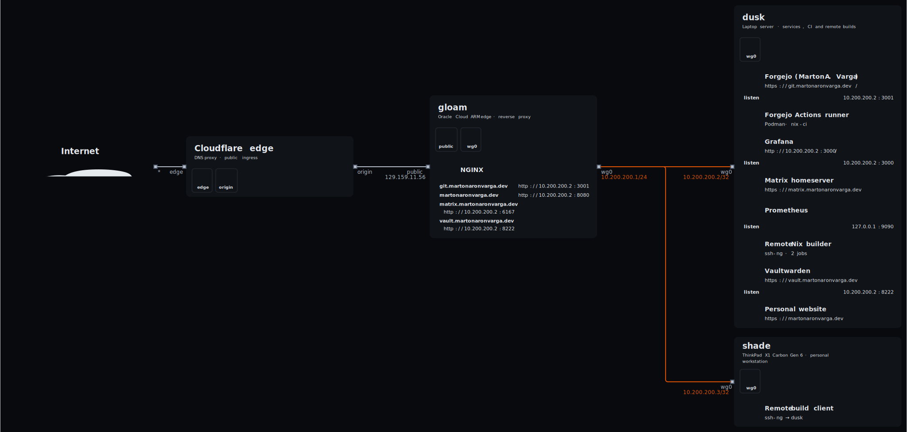

# nix infrastructure

This repository is the source of truth for my laptop, home server, and public
edge. It started as a "dotfiles" flake and gradually became the place where
I keep the whole system: disks, networking, desktop configuration,
secrets wiring, services, monitoring, backups, and deployment policy.

I want the machines to be reproducible without pretending that state does not
exist. Nix defines what should run, agenix supplies runtime secrets, and
impermanence makes every piece of state earn an explicit place under `/persist`.
In particular, I try to make every runtime directory ephemereal where useless
data would build up long term.

## Three machines

| Host | Role | What lives there |
| --- | --- | --- |
| **shade** | Personal ThinkPad and workstation | Hyprland desktop, Home Manager, development tools, and the main deployment environment |
| **dusk** | Home server and remote builder | Website, Vaultwarden, Forgejo and Actions runner, Matrix, monitoring, alerting, backups, and Nix build capacity |
| **gloam** | Small public ARM edge | TLS termination, public nginx ingress, and the stable WireGuard meeting point for Shade and Dusk |

Public traffic reaches Cloudflare first, then Gloam, and crosses WireGuard to
the services on Dusk.

```text
internet -> Cloudflare -> gloam -> WireGuard -> dusk
                                      |
                                    shade
```

The generated topology contains the more detailed view:



## What is self-hosted

Dusk currently provides:

- `martonaronvarga.dev`, built from its own flake input;
- Vaultwarden for passwords and passkeys;
- Forgejo, a private Actions runner, and persistent Nix CI caches;
- a Continuwuity Matrix homeserver;
- Prometheus, Alertmanager, Grafana, node exporters, and layered public/network
  probes;
- local and removable-drive backup jobs.

Gloam owns the public certificates and reverse proxies. Shade can also offload
ordinary `nix build` work to Dusk without going through Forgejo Actions.

## Repository map

- `parts/hosts.nix` registers every host and assembles its profiles,
  capabilities, deployment settings, and Home Manager configuration.
- `parts/inventory.nix` is the shared map of addresses, ports, domain names,
  and mail/etc. identities.
- `hosts/<host>/` contains hardware, storage, persistence, and services that
  belong to one machine.
- `profiles/nixos/` composes broad roles such as laptop, desktop, server, and
  headless host.
- `modules/nixos/` contains reusable system modules.
- `modules/home/` contains the user environment and desktop configuration.
- `packages/` contains local packages that are not available in the required
  form upstream.
- `secrets/` contains age-encrypted material and recipient declarations; clear
  text secrets never belong in the flake.
- `docs/` contains operational notes and longer design decisions that would
  make this README noisy.

Host registration is deliberately centralized. `parts/hosts.nix` generates the
NixOS configurations, package aliases such as `.#shade`, and Colmena nodes from
the same declarations.

## Everyday commands

Enter the development environment when the required tools are not already in
your profile:

```sh
nix develop
```

### Format and validate

The complete pre-deployment check is:

```sh
nix fmt .
alejandra --check .
statix check .
deadnix --fail .
nix flake check --no-write-lock-file
```

Build the two x86 machines explicitly:

```sh
nix build .#shade
nix build .#dusk
```

`nix flake check` evaluates all declared hosts and also checks formatting,
Statix, and dead Nix code. The explicit builds are still useful before a real
deployment because they realize the full system closures.

### Switch Shade

Test a generation without making it the boot default:

```sh
sudo nixos-rebuild test --flake .#shade
```

Build, activate, and make it the default:

```sh
sudo nixos-rebuild switch --flake .#shade
systemctl --failed --no-pager
systemctl --user --failed --no-pager
```

Alternative use `nh`:

```sh
nh os switch .#shade
nh os switch .#dusk
```

### Deploy Dusk and Gloam

Build or deploy one Colmena node from the dev shell:

```sh
nix develop -c colmena build --on dusk
nix develop -c colmena apply --on dusk
nix develop -c colmena apply --on gloam
```

### Offload a build to Dusk

Shade provides a small wrapper that sends all build jobs to its configured
remote builder:

```sh
nix-build-remote .#shade
nix-build-remote .#some-package
```

The equivalent low-level flag is `nix build --max-jobs 0 ...`.

### Regenerate the topology

```sh
nix build .#topology
cp result/main.svg assets/topology.svg
```

The build also produces `result/network.svg`, which focuses on network links
rather than the full host and service inventory.

### Compare and roll back

Inspect the difference between the active generation and a new build:

```sh
dix /run/current-system result
```

List system generations:

```sh
sudo nix-env --list-generations --profile /nix/var/nix/profiles/system
```

The previous generation can be selected from systemd-boot or activated
directly. Service-specific failures should be investigated before rolling back
unrelated host state; the longer checklist lives in
[`docs/deployment.md`](docs/deployment.md).

## Design rules

- Persistent state must be declared under `/persist`.
- Host-specific decisions stay in `hosts/<host>`; reusable behavior becomes a
  module or capability.
- Secrets are decrypted into `/run/agenix`, never copied into Nix source.
- Dusk services bind to the private WireGuard network unless public exposure is
  deliberately provided through Gloam.
- The disko, encrypted Btrfs, blank-root rollback, and impermanence model are
  part of the architecture, not installation leftovers.
- Changes should pass the complete validation sequence before deployment.

For operational detail, start with [`docs/deployment.md`](docs/deployment.md),
[`docs/dusk-operations.md`](docs/dusk-operations.md), and
[`docs/ci-and-remote-builds.md`](docs/ci-and-remote-builds.md).
